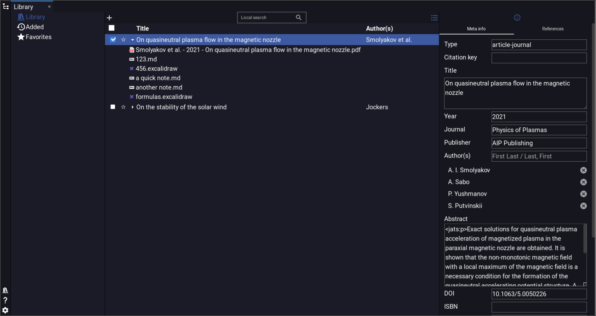
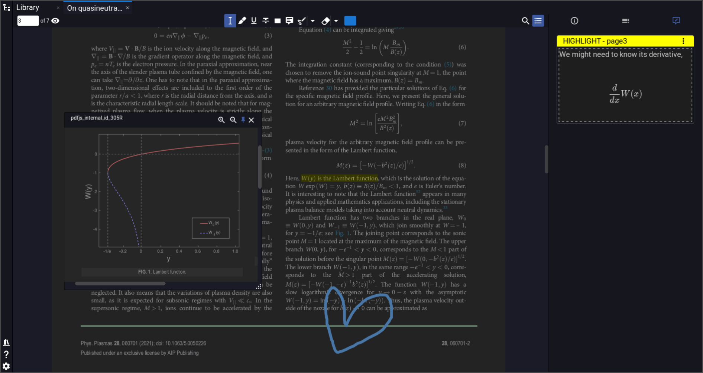
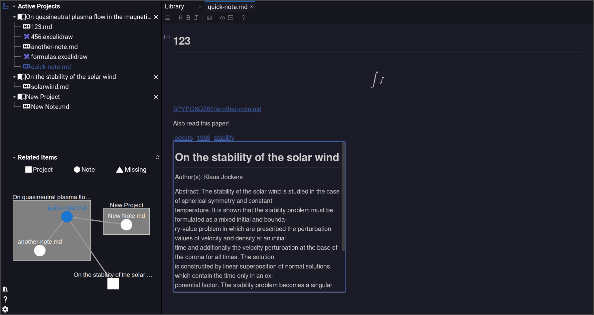
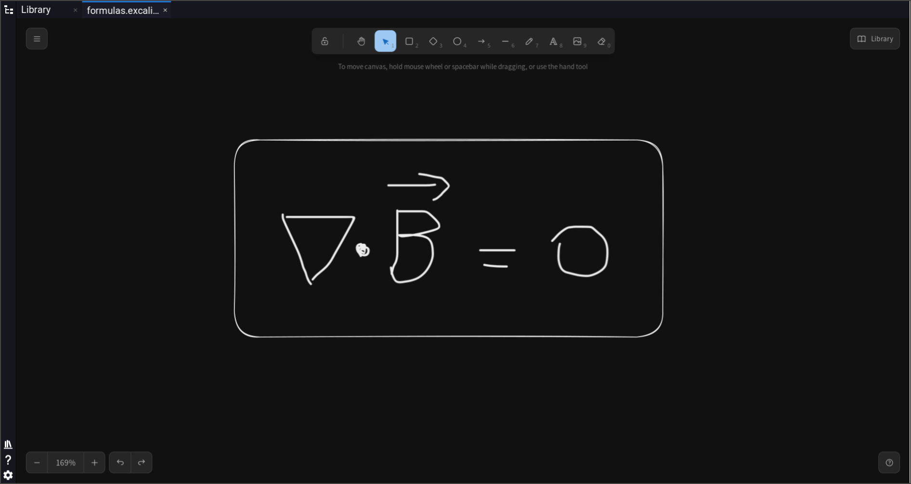

<p align="center">

<br>
<h2 align="center">Sophosia: 你的研究小助手</h2>
<br>
<a title="Release" target="_blank" href="https://github.com/sophosia/sophosia/releases"></a>
<a title="Downloads" target="_blank" href="https://github.com/sophosia/sophosia/releases"></a>
<br>
<a title="X" target="_blank" href="https://x.com/sophosia_app"></a>
<a title="QQ" target="_blank" href=""></a>
<a title="Discord" target="_blank" href="https://discord.gg/8RDZE85tBj"></a>
</p>

<p align="center">
<a href="https://github.com/sophosia/sophosia/blob/main/README.md">English</a>
|
<a href="https://github.com/sophosia/sophosia/blob/main/README.zh_CN.md">中文</a>
</p>

> [!NOTE]
> ## 普通用户请在[最新发布](https://github.com/sophosia/sophosia/releases/latest)下载Sophosia即可使用
> ## 若要贡献此项目，在根据README结尾处的说明进行操作。

# 研究小助手

研究小助手是一款开源的文献管理工具。它有着内置的 PDF 阅读器，所见即所得的 Markdown 编辑器以及 Excalidraw 画板。你可以很好地用它来管理自己的电子书，文献以及笔记。

## 管理文献及笔记

创建笔记、删除笔记、收藏文献、修改文献信息、搜索文献、管理标签……所有基本功能都在这里。


## 阅读和注释 PDF

PDF 阅读器带有内部链接查看器，无需来回翻页即可阅读数字、表格和公式。当然，PDF 阅读器支持注释，且注释支持 LaTeX 输入。非常适合理工研究人员。


## 用 Markdown 做笔记

所见及所得的 Markdown 是最优雅的记笔记方式。借助双链的力量，您可以构建属于自己的知识网络。


## 使用 Excalidraw 画图

利用无边框的画布释放您的思维。非常适合喜欢用笔书写和画图的人。


# 为研究小助手作贡献

研究小助手用[QUASAR](https://quasar.dev)作为框架。这款软件采用了[Vue.js3](https://vuejs.org)加[Electron](https://www.electronjs.org)的组合。

## 安装依赖

1. Tauri 的安装教程可以在[Tauri 的官网](https://tauri.app/v1/guides/getting-started/setup)上找到.
2. 前端采用了 Vue3，详细的配置在`package.json`中可以找到。推荐使用`yarn`进行依赖的管理。

```bash
yarn # 推荐用yarn
# 或者
npm install
```

## 开始开发吧

```bash
yarn dev # 开发模式
```

## 编译

```bash
yarn build # 编译发行版
```

## 测试

```bash
yarn test:unit:ci # 后端单元测试
yarn test:component:ci # 前端Vue Component测试
```

# 致谢

没有以下的开源项目就没有这款软件

- Quasar
- Tauri
- Vue.js
- citation-js
- cytoscape
- golden-layout
- EmbedPDF
- pdf.js
- konva
- vditor
- Excalidraw
